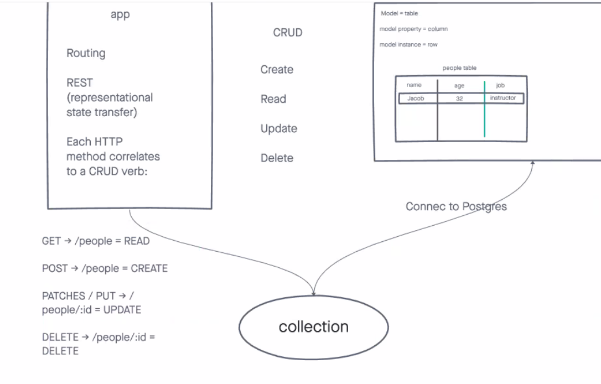

# Basic API Server

Deployed Site: https://basic-api-server-project.herokuapp.com/ 
Latest Pull Request: https://github.com/Micha-L-Davis/basic-api-server/pull/1

## Installation

1. Clone this repository onto your local machine
2. `cd` into `./basic-api-server`
3. Install package dependencies with `npm install`

## Author

Micha Davis

## Routes

* POST : `/people`
    * Parameters: 
        * name (required)
        * age
        * job
    * Response
        * 500 if no name parameter
        * 200 if valid.   

* POST : `/places`
    * Parameters: 
        * name (required)
        * county
        * city
    * Response
        * 500 if no name parameter
        * 200 if valid.   

* GET : `/people` 
    * Response:
        * 200 and array of person objects

* GET : `/places`
    * Response:
        * 200 and array of place objects

* GET : `/people/:id`
    * Parameters:
        * id required 
    * Response:
        * 200 and array of one specific person object.
        * 200 and an empty array if no results found.

* GET : `/places/:id`
    * Parameters:
        * id (required) 
    * Response:
        * 200 and array of one specific person object.
        * 200 and an empty array if no results found.

* PUT : `/places/:id`
    * Parameters:
        * id (required)  
    * Response:
        * 200 and an array [0]

* PUT : `/places/:id`
    * Parameters:
        * id (required)  
    * Response:
        * 200 and an array [0]

* DELETE : `/people/:id`
    * Parameters:
        * id (required)  
    * Response:
        * 200 and a 1 if successful
        * 200 and a 0 if unsuccessful

